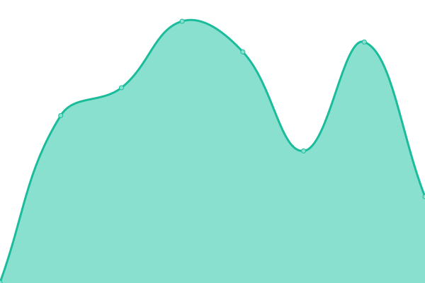

### [📈 Live Status](https://demo.upptime.js.org): <!--live status--> **🟩 All systems operational**

This repository contains the open-source uptime monitor and status page for [dplayz](dplayzgames06.tk), powered by [Upptime](https://github.com/upptime/upptime).

  
CI Information

With [Upptime](https://upptime.js.org), you can get your own unlimited and free uptime monitor and status page, powered entirely by a GitHub repository. We use [Issues](https://github.com/dplayz/status/issues) as incident reports, [Actions](https://github.com/dplayz/status/actions) as uptime monitors, and [Pages](https://status.dplayzgames06.tk) for the status page.

With [Upptime](https://upptime.js.org), you can get your own unlimited and free uptime monitor and status page, powered entirely by a GitHub repository. We use [Issues](https://github.com/dplayz/status/issues) as incident reports, [Actions](https://github.com/dplayz/status/actions) as uptime monitors, and [Pages](https://status.dplayzgames06.tk) for the status page.

With [Upptime](https://upptime.js.org), you can get your own unlimited and free uptime monitor and status page, powered entirely by a GitHub repository. We use [Issues](https://github.com/dplayz/status/issues) as incident reports, [Actions](https://github.com/dplayz/status/actions) as uptime monitors, and [Pages](https://status.dplayzgames06.tk) for the status page.

<!--start: status pages-->
<!-- This summary is generated by Upptime (https://github.com/upptime/upptime) -->
<!-- Do not edit this manually, your changes will be overwritten -->
<!-- prettier-ignore -->
| URL | Status | History | Response Time | Uptime |
| --- | ------ | ------- | ------------- | ------ |
|  [Main Website Service](https://dpG06.top) | 🟩 Up | [main-website-service.yml](https://github.com/dplayz/status/commits/HEAD/history/main-website-service.yml) | 

 357ms
     
 | 

<a href="https://status.dpG06.top/history/main-website-service">100.00%</a>
    

|  [Link Service](https://go.dpg06.top) | 🟩 Up | [link-service.yml](https://github.com/dplayz/status/commits/HEAD/history/link-service.yml) | 

 318ms
     
 | 

<a href="https://status.dpG06.top/history/link-service">100.00%</a>
    

|  [Status Service](https://status.dpG06.top) | 🟩 Up | [status-service.yml](https://github.com/dplayz/status/commits/HEAD/history/status-service.yml) | 

 362ms
     
 | 

<a href="https://status.dpG06.top/history/status-service">100.00%</a>
    

|  [Fastbin Service](https://code-snippets.dpG06.top) | 🟩 Up | [fastbin-service.yml](https://github.com/dplayz/status/commits/HEAD/history/fastbin-service.yml) | 

 483ms
     
 | 

<a href="https://status.dpG06.top/history/fastbin-service">100.00%</a>
    

<!--end: status pages-->

## 📄 License

- Powered by: [Upptime](https://github.com/upptime/upptime)
- Code: [MIT](./LICENSE) © [dplayz](dplayzgames06.tk)
- Data in the `./history` directory: [Open Database License](https://opendatacommons.org/licenses/odbl/1-0/)
